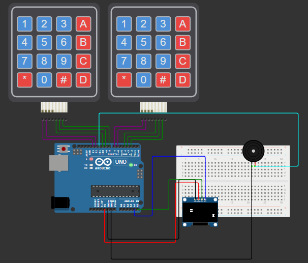
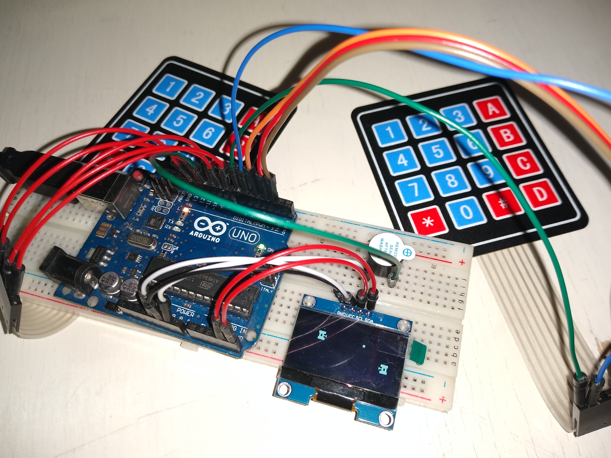

# 🏙️ Battle City | Sem. Arduino - UNQ - 2024c1

Proyecto para la materia **Seminarios: Programación de controladores con Arduino**

## Integrantes del proyecto
- Santiago Abregú
- Franco Garcino Ruiz

## 📑 Descripción del proyecto

El proyecto desarrollado es un videojuego inspirado en Battle City, un juego desarrolado por Namco para la NES (en 1985), Game Boy (1991) y Wii (2007), el que el/los jugador/es controlaban tanques para defender su base de los tanques enemigos, controlados por la consola.
Con el objetivo de realizar un juego más interactivo para una breve presentación, se decició modificar un poco la jugabilidad, haciendo que los dos jugadores compitan por destruir al tanque del otro.

[Video del juego original](https://youtu.be/QTbc9G1-QvE?si=qHt_faHgBN-uBTlS)

## 🔧 Componentes del proyecto

Para la construcción del proyecto, se utilizaron:

```
1x Arduino UNO
1x Protoboard
2x Keypads
1x Buzzer
1x OLED Screen SH1106
Varios cables para las conexiones
```

### ¿Donde se consiguieron los componentes?

En nuestro caso, uno de los integrantes del equipo contaba con todos los materiales necesarios a excepción de la pantalla, la cual se consiguio desde MercadoLibre, en el siguiente enlace [OLED Screen SH1106](https://articulo.mercadolibre.com.ar/MLA-732244314-display-oled-13-blanco-128x64-i2c-sh1106-arduino-candy-_JM)

```
OLED Screen SH1106
Precio: $8500 (Jul 2024)
```

## 💻 Código fuente del programa del microcontrolador

El código del proyecto se encuentra en este repositorio, en la carpeta `tanks`, teniendo:

- La lógica del juego dentro del archivo [tanks.ino](/tanks/tanks.ino)
- La abstracción de los tanques (jugadores) en [Tank.cpp](/tanks/Tank.cpp)
- La abstracción de las balas (ataques) en [Bullet.cpp](/tanks/Bullet.cpp)

## 🔍 Esquema



## 🐞 Problemas encontrados y su solución

> ⚠️ Originalmente, la idea era que ambos jugadores puedan disparar simultaneamente, incrementando las probabilidades de perder la partida, pero por dificultades de implementación se simplificó la mecánica.
> 
> ✔️ Se decidio por limitar la cantidad de disparos en simultaneo a 1 entre ambos jugadores.

> ⚠️ Originalmente, se quería incluir una pantalla de Game Over, que indique qué jugador ganó, pero no logramos usar la interfaz de escritura de la pantalla.
> 
> ✔️ Se decidio emular una pantalla de fin del juego más sencilla, únicamente con un sonido de fin del juego.

> ⚠️ Originalmente, se planteó el añadir una canción al iniciar una partida.
> 
> ✔️ Se decidió descartar dicha idea para simplificar el proyecto.

## 🖼️ Foto del armado



## 🖥️ Software utilizado

- Arduino IDE
- Las librerias para interactuar con los componentes:

| Libreria        | Version              |
|-----------------|----------------------|
| Adafruit SH110X | v. 2.1.10            |
| Keypad          | v. 3.1.1             |

---

UNQ - Abregú, Garcino Ruiz - 2024c1
